# Olá, eu sou o Leandro 👋

**Engenheiro Ambiental** e **Desenvolvedor Full Stack Sênior** com foco em **GIS / Geotecnologias**, em Minas Gerais. Uno a visão ambiental com tecnologia, transformando dados geoespaciais em mapas web, ferramentas de análise e aplicações que ajudam a tomar decisões no território.

## 🔥 umgrauemeio

Atualmente sou **Desenvolvedor Full Stack Sênior** na [**umgrauemeio**](https://www.umgrauemeio.com), onde desenvolvo a plataforma de **monitoramento e prevenção de incêndios**, que ajuda a detectar focos cedo e a agir mais rápido no campo.

## 🗺️ geoStudio

Sou mantenedor da [**geoStudio**](https://www.geostudio.space), onde desenvolvo soluções em geotecnologia:

- WebGIS com **Leaflet** e **Mapbox GL JS**
- Dados geoespaciais modernos: **GeoParquet**, GeoJSON, processamento com **Python / ArcPy**
- APIs e back-end com **FastAPI** e **Django**

## 🛠️ Stack

## 📫 Contato

## 🎯 Hobbies

Fora do código, você me encontra numa trilha de 🚵 **MTB**, pensando no próximo lance de ♟️ **xadrez** ou em cima de um 🛹 **skate**.

